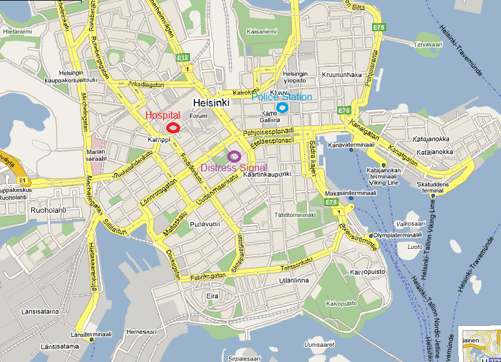
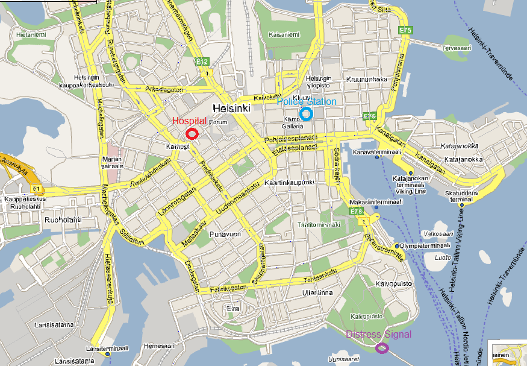
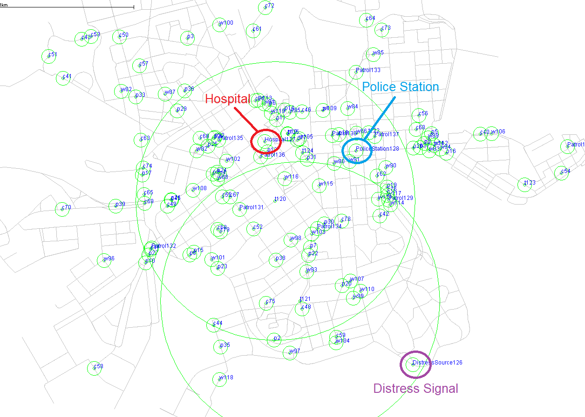

# Performance Characteristics of Epidemic and Spray-and-Focus Routing Protocols During an Emergency Scenario

## Introduction
This repository contains the research and findings on the performance characteristics of the Epidemic and Spray-and-Focus (SNF) routing protocols during emergency scenarios using the ONE simulator. The focus of this study is on Delay Tolerant Networks (DTNs), specifically Vehicular Delay Tolerant Networks (VDTNs).

## Background
### Delay Tolerant Networks (DTNs)
DTNs address the lack of end-to-end connectivity by using a store-carry-forward protocol. These networks are categorized into forwarding-based and replication-based protocols.

### Vehicular Ad-Hoc Networks (VANETs)
VANETs are a type of mobile ad-hoc network designed for vehicles, featuring characteristics such as large scale, high mobility, and partitioned networks.

### Vehicular Delay Tolerant Networks (VDTNs)
VDTNs combine the properties of DTNs with VANETs, leveraging opportunistic, self-organized, and autonomous network behaviors.

### Routing Protocols
- **Epidemic Protocol:** A flooding protocol that maximizes message delivery by spreading unlimited copies throughout the network.
- **Spray-and-Focus (SNF) Protocol:** Uses a single-copy routing scheme divided into Spray and Focus phases to optimize message delivery and minimize resource consumption.

### ONE Simulator
The Opportunistic Networking Environment (ONE) simulator is used to evaluate DTN routing protocols in various scenarios.

## Design
Two emergency scenarios were designed:
1. **Scenario 1:** A distress signal is sent from a node near emergency facilities.
       
2. **Scenario 2:** A distress signal is sent from a remote node far from emergency facilities.
       

## Implementation
The scenarios were implemented using the ONE simulator with the following setup:
- Various groups representing distress signals, hospitals, police stations, and patrolling emergency vehicles.
- Simulations included adjustments to buffer sizes and the number of patrolling units to enhance protocol performance.

## Evaluation
### Scenario 1
- **Epidemic Protocol:** Low delivery probability (14.3%) with high dropped packets and overhead ratio.
- **SNF Protocol:** High delivery probability (99.6%) with low dropped packets and overhead ratio.
- **Improved Epidemic:** Increased buffer size and patrolling units improved delivery probability to 30.9%.

[Scenario 1 - Delivery Probability](images/image_5.png)

### Scenario 2
- **Epidemic Protocol:** Lower delivery probability (9.6%) compared to Scenario 1.
- **SNF Protocol:** Consistently high delivery probability (99.5%) with low dropped packets and overhead ratio.
- **Improved Epidemic:** Increased buffer size and patrolling units improved delivery probability to 26.1%.

## Conclusion
The study demonstrates that the SNF protocol outperforms the Epidemic protocol in both emergency scenarios. SNF shows high delivery probability and low resource consumption, making it more suitable for emergency situations. Enhancements to the Epidemic protocol improved performance but still lagged behind SNF.

## Bibliography
A detailed list of references and sources used in this study is included in the full report.
    
